# SyncMMH: A Multimodal Dataset of Full-Body Motion in Manual Material Handling Tasks Integrating Motion Capture and Vision-Based Pose Estimation

**SyncMMH** integrates motion capture and vision-based pose estimation for biomechanical analysis of manual material handling (MMH) tasks.

- **35,299 trials** (~27.7 hours) from **24 participants** (12 M, 12 F)
- **7 activities**: pushing, pulling, sitting, standing, walking, lifting, carrying
- **4 modalities**: 360° multi-view video (5-camera setup), 3D motion capture (ground truth), vision-based 3D pose (BlazePose, 22 keypoints), metadata

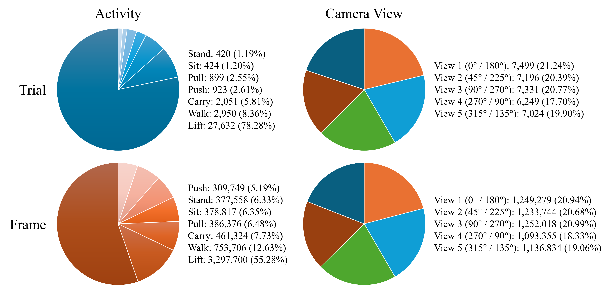

Breakdown below generated with `scripts/dataset_summary.py` (excludes subject `s1`, not part of the 24 released participants); **5,965,230 frames** total.

**By activity**

| Activity | Trials | Frames | Duration (min) |
|---|---:|---:|---:|
| Push | 923 (2.61%) | 309,749 (5.19%) | 86.65 (5.21%) |
| Pull | 899 (2.55%) | 386,376 (6.48%) | 108.16 (6.50%) |
| Sit | 424 (1.20%) | 378,817 (6.35%) | 106.17 (6.38%) |
| Stand | 420 (1.19%) | 377,558 (6.33%) | 105.82 (6.36%) |
| Walk | 2,950 (8.36%) | 753,706 (12.63%) | 210.65 (12.66%) |
| Lift | 27,632 (78.28%) | 3,297,700 (55.28%) | 917.53 (55.15%) |
| Carry | 2,051 (5.81%) | 461,324 (7.73%) | 128.86 (7.74%) |

**By camera**

| Camera | Trials | Frames | Duration (min) |
|---|---:|---:|---:|
| c1 | 7,499 (21.24%) | 1,249,279 (20.94%) | 348.42 (20.94%) |
| c2 | 7,196 (20.39%) | 1,233,744 (20.68%) | 344.15 (20.68%) |
| c3 | 7,331 (20.77%) | 1,252,018 (20.99%) | 349.24 (20.99%) |
| c4 | 6,249 (17.70%) | 1,093,355 (18.33%) | 305.02 (18.33%) |
| c5 | 7,024 (19.90%) | 1,136,834 (19.06%) | 317.01 (19.05%) |

Lifting dominates the trial count because each lift/carry repetition (a single pick-up-and-place motion) is logged as its own trial, while push/pull/sit/stand/walk trials span a longer continuous action.

---

## Repository Structure

```
SyncMMH/
├── data/
│   └── metadata.txt             # trial identifiers and frame indices (559 KB)
├── figures/
│   ├── dataset_overview.png
│   ├── experimental_layout.png
│   ├── mocap_marker_placement.png
│   ├── blazepose_keypoints.png
│   ├── lifting_setup.png
│   └── task_overview.png
├── scripts/
│   ├── dataset_summary.py       # trial/frame counts by activity, camera, subject
│   ├── visualize_mocap.py       # 3D animated skeleton from motion capture
│   └── visualize_pose.py        # 2D multiview skeleton from pre-processed BlazePose keypoints
├── visualization/                # generated multiview clips (see Gallery section)
│   ├── push_multiview.gif
│   ├── pull_multiview.gif
│   ├── sit_multiview.gif
│   ├── stand_multiview.gif
│   ├── walk_multiview.gif
│   ├── lift_multiview.gif
│   └── carry_multiview.gif
├── LICENSE                      # CC BY 4.0
└── README.md
```

---

## Data Download

The large data files are hosted externally. See the [Modalities](#modalities) section below for download links and the folder structure to use after downloading.

| Component | Size | Format | Host |
|---|---|---|---|
| Motion capture | 304 GB | `.trc` | Available upon request — contact [apps.ehee@gmail.com](mailto:apps.ehee@gmail.com) |
| Pose (all cameras) | 3.62 GB | `.txt` | *(link to be added)* |
| Metadata | 559 KB | `.txt` | Included in this repo |

---

## Experimental Setup

Five GoPro Hero8 Black cameras (1920×1080, 60 Hz, 122.6° horizontal / 94.4° vertical FOV) and a 14-camera infrared motion capture system (Cortex v7.02.1815, Motion Analysis Corp.) were mounted on tripods at 1.4 m height to provide 360° coverage — front, back, diagonal, and side views — of the participant performing MMH tasks.

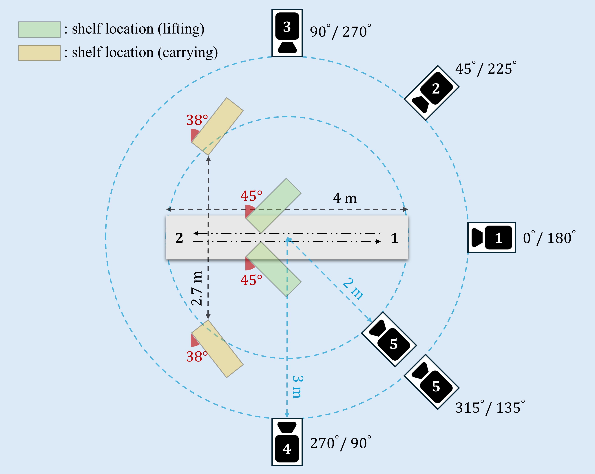

Seven tasks were recorded across five sessions (with a 10-min break between sessions): pushing and pulling a cart, sitting and standing, walking, lifting, and carrying.

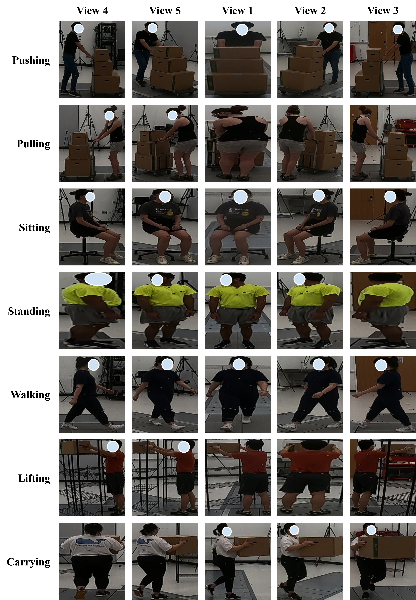

---

## Quick Start

```bash
# Dataset summary — trial/frame counts by activity, camera, and subject
cd scripts
python dataset_summary.py

# Visualize a motion capture trial (motion capture data not yet released)
# python visualize_mocap.py <path_to.trc> <start_frame> <end_frame>
```

---

## File Naming Convention

The activity and experimental conditions for each trial are encoded into a **trial identifier** in `data/metadata.txt`, following this format:

```
[activity]_[camera]-[subject]-[task parameters]-[filename]
```

**Example:** `lift_c1-s1-sr2laf-GH010014` — a lifting trial using a small box, moved right-to-left, at an adjacent shelf location, recorded by fixed cameras.

| Field | Values |
|---|---|
| `activity` | `push`, `pull`, `sit`, `stand`, `walk`, `lift`, `carry` |
| `camera` | `c1`–`c5` |
| `subject` | `s1`–`s25` |
| `filename` | GoPro video filename (e.g., `GH010014`) |

**`task parameters`** — the tag's structure depends on the activity:

| Activity | Tag structure | Values |
|---|---|---|
| Push / Pull | `[relation]` | `gc` (getting close) or `gf` (getting far) — spatial relationship of the participant to Camera 3, positioned in front of the path |
| Sit / Stand | `na` | No task parameters apply; the tag is fixed as non-applicable |
| Walk | `[relation][view]` | `relation`: `gc`/`gf` as above. `view`: `cv` (close-up view, cameras repositioned 2 m from the path center for the second half of the walking trials) or `rv` (regular view, default camera positions) |
| Lift / Carry | `[size][direction][location][state]` | `size`: `s` (small), `m` (medium), `l` (large). `direction`: `r2l` (right-to-left) or `l2r` (left-to-right). `location`: `a` (adjacent shelves) or `d` (distant shelves). `state`: `f` (fixed cameras) or `m` (moving cameras) |

Immediately below each trial identifier, one or more `start_frame/end_frame` lines (1-based) mark the trial's extent. Lifting and carrying trials involve multiple repetitions per recording, so their identifiers are followed by multiple frame-index lines; every other activity is a single trial with just one line.

---

## Gallery

Multiview clips generated end-to-end from raw video via `scripts/pose_pipeline_sample_multiview.py` — pose estimation and preprocessing use the same settings as `n1_pose_estimation.py`/`n2_pre_processing.py`, cameras are auto-synced by cross-correlating joint motion across views, and all 5 cameras are rendered side by side in `c4, c5, c1, c2, c3` order. Example identifiers below use subject `s25`; see [File Naming Convention](#file-naming-convention) for what each field means.

**Push** — `s25-gf`
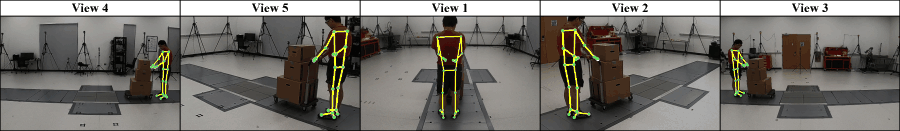

**Pull** — `s25-gc`
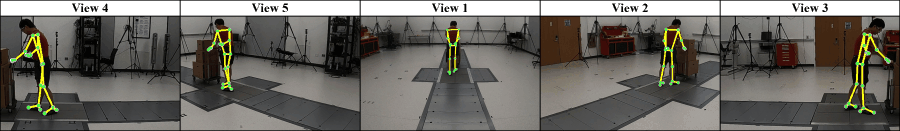

**Sit** — `s25-na`
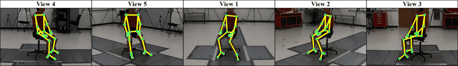

**Stand** — `s25-na`
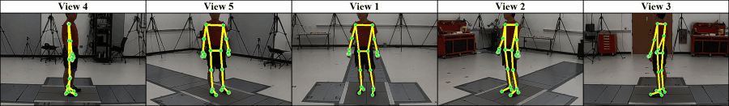

**Walk** — `s25-gfrv`
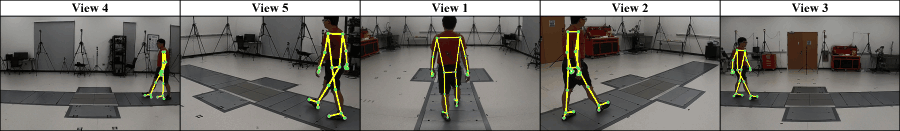

**Lift** — `s25-sr2laf`
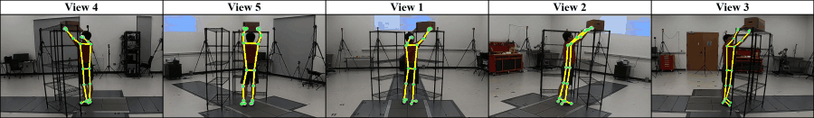

**Carry** — `s25-lr2ldf`
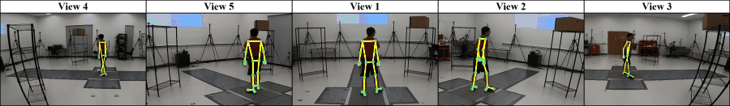

---

## Modalities

### 1. Multi-View Video (`.mp4`)

Original 360°-coverage video in `.mp4` format (1.24 TB total). Not offered as a bulk download given its size.

- **Cameras**: 5 × GoPro Hero8 Black, 1920×1080, 60 Hz, 122.6° horizontal / 94.4° vertical FOV, mounted on tripods at 1.4 m height
- **Coverage**: front, back, diagonal, and side views of the participant (see camera positions below)


This is the raw footage `scripts/pose_pipeline_sample_multiview.py` runs pose estimation on for `data/sample videos/`; the full released set follows the same 5-camera layout.

### 2. Motion Capture (`.trc`)

3D motion capture recordings in `.trc` format (304 GB total). Available upon request — contact [apps.ehee@gmail.com](mailto:apps.ehee@gmail.com).

After downloading, create a `data/motion_capture/` folder and place files so the structure looks like:

```
data/motion_capture/
├── s01/
│   ├── session1_push_pull.trc
│   ├── session2_sit_stand.trc
│   ├── session3_walk.trc
│   ├── session4_lift.trc
│   └── session5_carry.trc
├── s02/
└── ...
└── s24/
```

- **System**: Cortex v7.02.1815 (Motion Analysis Corp.), 14 infrared cameras, 60 Hz
- **Markers**: 37 reflective markers (ISB placement)
- **Coordinate system**: Origin at force plate intersection; X = mediolateral, Y = vertical, Z = anterior-posterior (mm)

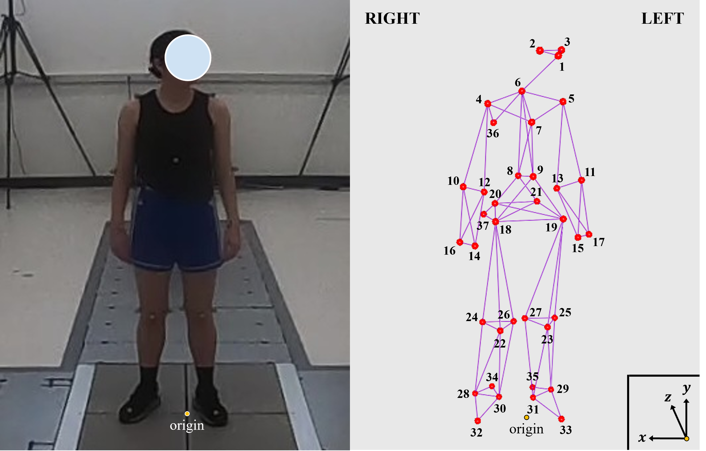

Thirty-seven reflective markers were attached to anatomical landmarks following ISB recommendations. The coordinate origin is defined as the intersection of the four force plates on the ground.

| Index | Marker | Index | Marker |
|-------|--------|-------|--------|
| 1 | Forehead | 2/3 | Temple (R/L) |
| 4/5 | Acromion — shoulder points (R/L) | 6 | C7 — spinous process of the 7th cervical vertebra (base of neck) |
| 7 | Suprasternal notch (base of throat) | 8 | T8 — spinous process of the 8th thoracic vertebra (mid-back, below shoulder blades) |
| 9 | Xiphoid process (bottom tip of breastbone) | 10/11 | Lateral epicondyle — outer elbows (R/L) |
| 12/13 | Medial epicondyle — inner elbows (R/L) | 14/15 | Radial styloid — wrists, thumb side (R/L) |
| 16/17 | Ulnar styloid — wrists, pinky side (R/L) | 18/19 | ASIS — anterior superior iliac spine, front of hip bones (R/L) |
| 20/21 | PSIS — posterior superior iliac spine, lower back dimples (R/L) | 22/23 | Patella — kneecaps (R/L) |
| 24/25 | Lateral tibial condyle — outer upper shins (R/L) | 26/27 | Medial tibial condyle — inner upper shins (R/L) |
| 28/29 | Lateral malleolus — outer ankle bones (R/L) | 30/31 | Medial malleolus — inner ankle bones (R/L) |
| 32/33 | Big toe (R/L) | 34/35 | Calcaneus — heels (R/L) |
| 36/37 | Right-side identifiers | | |

Motion capture was recorded simultaneously with video at 60 Hz. For lifting tasks (Session 4), participants lifted three box sizes between two adjacent five-level shelves (small/medium) or four-level shelves (large).

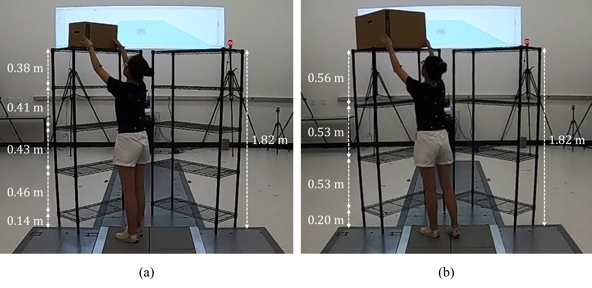

See `scripts/visualize_mocap.py` for visualization.

### 3. Vision-Based 3D Pose (`.txt`)

BlazePose 3D keypoint data in `.txt` format (3.62 GB total), organized by camera view. Download from: *(link to be added)*

After downloading, create a `data/pose/` folder and place files so the structure looks like:

```
data/pose/
├── c1/                  # Camera 1: 0° / 180°
│   ├── s01/
│   │   ├── <recording>.txt
│   │   └── ...
│   └── ...
├── c2/                  # Camera 2: 45° / 225°
├── c3/                  # Camera 3: 90° / 270°
├── c4/                  # Camera 4: 270° / 90°
└── c5/                  # Camera 5: 315° / 135°
```

- **Model**: Google BlazePose (22 keypoints)
- **Cameras**: 5 × GoPro Hero8 Black, 1920×1080, 60 Hz, 360° coverage
- **Per row**: 66 values = 22 keypoints × 3 (X, Y, Z in meters)
- **Shape after loading**: `(n_frames, 22, 3)`
- **Coordinate system**: Origin at hip midpoint; X = mediolateral, Y = vertical, Z = anterior-posterior (m)
- **Preprocessing**: Zero-phase 5th-order Butterworth low-pass filter at 5 Hz

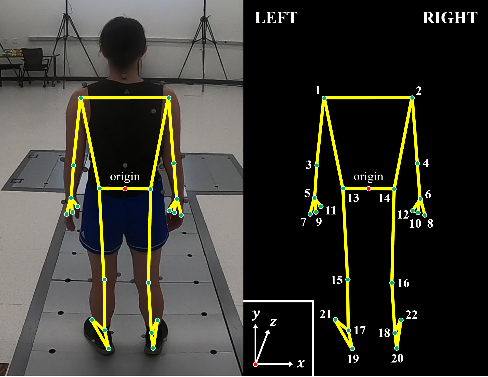

Twenty-two key body joints were extracted per frame using Google BlazePose. The coordinate origin (red dot) is defined as the midpoint between the hips.

| Index | Joint | Index | Joint |
|---|---|---|---|
| 0 | L shoulder | 1 | R shoulder |
| 2 | L elbow | 3 | R elbow |
| 4 | L wrist | 5 | R wrist |
| 6 | L pinky knuckle | 7 | R pinky knuckle |
| 8 | L index knuckle | 9 | R index knuckle |
| 10 | L thumb knuckle | 11 | R thumb knuckle |
| 12 | L hip | 13 | R hip |
| 14 | L knee | 15 | R knee |
| 16 | L ankle | 17 | R ankle |
| 18 | L heel | 19 | R heel |
| 20 | L index toe | 21 | R index toe |

See `scripts/visualize_pose.py` for visualization.

### 4. Metadata (`data/metadata.txt`)
- Trial identifiers encoding activity, camera, subject, and task parameters
- Start/end frame indices for each trial (1-based)

---

## To Do

- [ ] Re-run pose estimation with the heavy BlazePose model (`pose_landmarker_heavy.task`)
- [ ] Release the cross-camera pose synchronization code

---

## Citation

If you use SyncMMH in your research, please cite:

```bibtex
@article{jung2026syncmmh,
  title   = {SyncMMH: A Multimodal Dataset of Full-Body Motion in Manual Material
             Handling Tasks Integrating Motion Capture and Vision-Based Pose Estimation},
  author  = {Jung, Sehee and Xu, Xu},
  journal = {[journal to be added]},
  year    = {2026}
}
```

---

## License

This dataset is released under the [Creative Commons Attribution 4.0 International (CC BY 4.0)](LICENSE) license.
